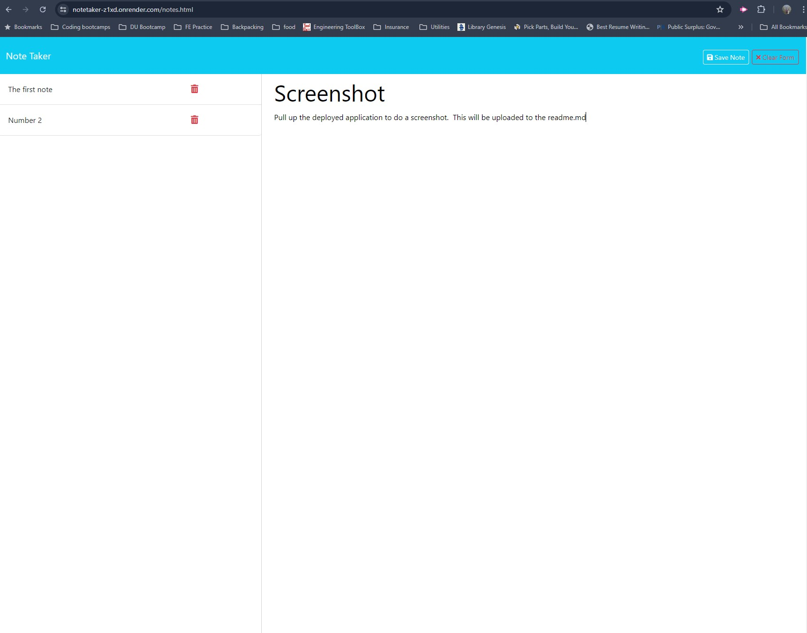

# Note Taker

## Description 
This application has been made to  help organize thoughts and keep track of tasks needed to be completed.

## Table of Contents
- [Installation](#installation)
- [Usage](#usage)
- [URL](#url)
- [Credits](#credits)
- [License](#license)
- [How to Contribute](#how-to-contribute)
- [Questions](#questions)

## Installation
No installs are needed to use the application.  Simply visit the url.

## Usage
When the user makes it to the deployed website, simply click on "Get started" button. You will be directed to a new page where the user can enter in a note title, and note text. After the text has been written, the user can either hit "Save Note" or "Clear Form". Save will save the note, and clear form will delete the entry.  After the user saves a note, it will apear on the left hand side for later reference.  The red emblem will delete the note if the user desires. 

## URL
https://notetaker-z1xd.onrender.com/notes.html

## Credits
N/A

## License

This project is licensed under the MIT 
- see the following link for details: [MIT License](https://opensource.org/licenses/MIT)

## How to Contribute
Devs can issue pull requests, write issues, and email the creater for more information.

## Questions
My github profile is: https://github.com/Taboada-B
 
My email is: b.taboada123@gmail.com
